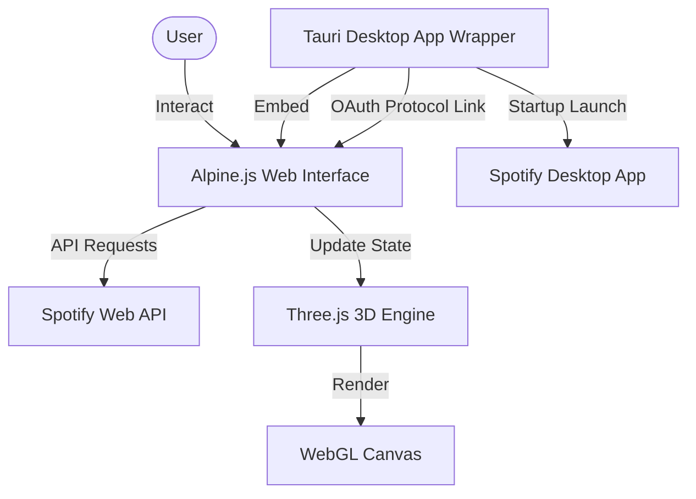

# Covify: 3D Spotify Visualizer
## System Architecture & Technical Blueprint

This document specifies the architecture, mathematics, state management, and API design of **Covify**, a premium 3D Spotify Album Art Visualizer. It contains all detail necessary to reproduce this software in other environments or language stacks (such as React, Swift, Flutter, Unity, or Unreal Engine).

---

## 1. System Overview & Core Concept

Covify connects to a user's Spotify account and visualizes their music library as an interactive, floating 3D canvas of album art covers. 

### Core Features:
- **PKCE-based Authentication**: Secure authentication flow that operates in both browser and native desktop environments.
- **Fibonacci Sphere Layout**: Album arts distributed evenly across the surface of a 3D sphere.
- **Cascading Drop Layout**: Physics-based grid where album arts drop from the sky and settle with a springy bounce.
- **Now Playing Equalizer Overlay**: A real-time animated equalizer that maps onto the album art of the active song in the 3D scene.
- **Precision Playback Bar**: Real-time seeking, hover timeline coordinates, and high-frequency (20fps) clock-based synchronization to prevent progress bar drift.
- **Unified Controls & Persistence**: One-click global state refreshes and persistent user selections stored in local storage.
- **Desktop Application Shell**: Packageable native build that launches the official Spotify app on startup and handles OAuth redirect schemes cleanly.



---

## 2. Directory Structure

Below is the complete project directory layout, showing the organization of the frontend web visualizer (Vite) and the native desktop wrapper (Tauri):

```text
Covify/
├── .env                              # Spotify Client ID configuration
├── .gitignore                        # Git ignore patterns
├── README.md                         # Project overview and run guides
├── SYSTEM_ARCHITECTURE.md             # Complete system architecture specification (this file)
├── progress.md                       # Features log and current project status
├── package.json                      # Node dependencies and project scripts
├── vite.config.js                    # Vite server configuration
├── index.html                        # Application main HTML window & Alpine UI
│
├── public/                           # Static public assets (empty)
│
├── src/                              # Frontend source code
│   ├── main.js                       # Alpine.js global store & playback controller
│   ├── style.css                     # Custom styles, transitions and HSL color tokens
│   ├── counter.js                    # Unused counter helper (dead code reference)
│   │
│   ├── spotify/                      # Spotify API Integration
│   │   ├── api.js                    # Spotify Web API client (playback, playlists, queue)
│   │   └── auth.js                   # PKCE OAuth flow (Tauri & browser authorization handlers)
│   │
│   └── three/                        # WebGL 3D Scene Rendering
│       └── sphere.js                 # Three.js scene, Fibonacci layouts, and equalizer canvas
│
└── src-tauri/                        # Tauri native desktop app wrapper
    ├── Cargo.toml                    # Rust crate dependencies
    ├── build.rs                      # Tauri build script
    ├── tauri.conf.json               # Tauri window and build config (deep links, capabilities)
    │
    ├── capabilities/                 # Tauri permissions declarations
    │   └── default.json              # Default capability configurations
    │
    ├── icons/                        # Application icons for macOS/Windows installers
    │   ├── 32x32.png
    │   ├── 128x128.png
    │   ├── 128x128@2x.png
    │   ├── icon.icns
    │   └── icon.ico
    │
    └── src/                          # Rust native launcher source
        ├── main.rs                   # Native entry point
        └── lib.rs                    # Setup hook, custom scheme handler, and Spotify player spawning
```

---

## 3. Component Design & System Architecture

The application is structured into three main layers:
1. **Application Shell (Tauri & Rust)**: Handles native windowing, deep-link protocol registration (`covify://`), and cross-platform operating system tasks.
2. **State & Logic (Alpine.js & ES6 Javascript)**: Manages Spotify API requests, OAuth tokens, playback states, progress clocks, UI responsiveness, and local storage caching.
3. **Graphics Engine (Three.js WebGL)**: Builds and updates the 3D environment, compiles shaders, runs drop animations, and projects dynamic overlay canvases onto meshes.

---

## 4. Core Modules & Implementation Details

### A. Authentication: OAuth 2.0 with PKCE Flow
To avoid storing client secrets on the client, Covify utilizes the **Authorization Code Flow with Proof Key for Code Exchange (PKCE)**.

#### Protocol Flow:
1. **Code Verifier**: Generate a random cryptographically strong string (43 to 128 characters).
2. **Code Challenge**: SHA-256 hash the code verifier, then Base64URL-encode the hash.
3. **Authorization Request**: Redirect the user to Spotify:
   ```
   https://accounts.spotify.com/authorize?
     client_id={VITE_SPOTIFY_CLIENT_ID}&
     response_type=code&
     redirect_uri={REDIRECT_URI}&
     code_challenge_method=S256&
     code_challenge={CODE_CHALLENGE}&
     scope=user-read-playback-state%20user-modify-playback-state%20playlist-read-private%20user-library-read
   ```
4. **Authorization Code**: The redirect returns a `code` parameter.
5. **Token Exchange**: Send a POST request to Spotify to exchange the authorization code for access and refresh tokens:
   ```
   POST https://accounts.spotify.com/api/token
   Content-Type: application/x-www-form-urlencoded

   client_id={CLIENT_ID}&
   grant_type=authorization_code&
   code={CODE}&
   redirect_uri={REDIRECT_URI}&
   code_verifier={CODE_VERIFIER}
   ```
6. **Token Refreshes**: Access tokens expire in 1 hour. Refresh them silently using the `refresh_token` parameter.

---

### B. 3D Graphics Engine & Layouts
The graphics engine uses WebGL to display album art textures mapped onto rectangular plane geometries.

#### 1. Fibonacci (Golden Angle) Sphere Layout
To place $N$ album art covers evenly on the surface of a sphere of radius $R$:
We use the **Fibonacci Sphere (Golden Spiral)** distribution. For each index $i$ from $0$ to $N-1$:

- Compute $y$-coordinate linearly from $1$ to $-1$:
  $$y_i = 1 - \frac{2i}{N - 1}$$
- Calculate the radius at height $y_i$:
  $$r_i = \sqrt{1 - y_i^2}$$
- Increment the angle $\theta_i$ using the Golden Angle ($\approx 137.5^\circ$ or $2.399963$ radians):
  $$\theta_i = i \times \pi \times (3 - \sqrt{5})$$
- Generate coordinates:
  $$x_i = r_i \times \cos(\theta_i) \times R$$
  $$z_i = r_i \times \sin(\theta_i) \times R$$
  $$y_i = y_i \times R$$

#### 2. Cascading Drop Layout
In **Drop Mode**, the items form a horizontal grid at $y \approx 0$ with physics-inspired animations:
- Items are initially positioned at $y_{start} \approx 30 + \text{random}(20)$ with `opacity = 0`.
- For each item, update position over time using a spring-damper equation:
  - Phase 1 (Gravity): $t \in [0, 0.6]$. Accelerate downward linearly.
  - Phase 2 (Bounce): $t \in [0.6, 1.0]$. Apply a damped sine-wave bounce:
    $$y = y_{target} + \sin(t_{bounce} \times 2.5\pi) \times e^{-4t_{bounce}} \times 0.3$$
- Gentle billboard rotation makes items tumble while falling, then settle flat.

#### 3. Billboard Behavior
In sphere mode, to keep album covers readable, we enforce billboard orientation. In every render frame:
$$\text{mesh.lookAt}(\text{camera.position})$$

---

### C. 3D Now Playing Equalizer Overlay
To display a "playing" indicator directly on the 3D mesh:
1. **Dynamic Canvas**: Create a 2D HTML Canvas element ($128 \times 128$ px) offscreen.
2. **Canvas Texture**: Wrap the canvas in a WebGL texture (`THREE.CanvasTexture`).
3. **Overlay Material**: Create a `MeshBasicMaterial` using the canvas texture with transparency enabled.
4. **Real-time Draw Loop**: In the render loop, if a song is playing:
   - Clear the canvas.
   - Fill with a semi-transparent black overlay (`rgba(18, 18, 18, 0.65)`).
   - Render 4 vertical bars. Calculate the height of each bar dynamically:
     $$h_i = 12 + |\sin(\text{time} + i \times 1.6)| \times 60 + \text{random}(8)$$
   - Trigger texture updates: `texture.needsUpdate = true`.
5. **Overlay Mesh Projection**: Attach this canvas-backed mesh slightly in front of the active song's album art mesh (`translateZ(0.015)`). Copy the active mesh's position, rotation, and scale.

---

### D. Precision Playback & Dynamic Seeking
To achieve smooth progress bar seeking and real-time timeline updates:
1. **System Clock Reference**: Avoid incremental intervals (e.g. `current += 1s`) which drift and stutter.
2. **Sync Anchor**: When syncing playback states, cache three points:
   - `progressMs`: Spotify's report of progress in milliseconds.
   - `lastStateSyncTime`: The exact timestamp (`Date.now()`) when the API sync was received.
   - `durationMs`: The total song length.
3. **High-Frequency Update (20fps)**: Every 50ms, calculate progress using the system clock:
   $$\text{elapsed} = \text{Date.now()} - \text{lastStateSyncTime}$$
   $$\text{currentProgressMs} = \text{progressMs} + (\text{isPlaying} ? \text{elapsed} : 0)$$
   $$\text{progressFraction} = \frac{\text{currentProgressMs}}{\text{durationMs}}$$
4. **Interactive Seek**: Clicking the progress bar calculates the client percentage:
   $$\text{pct} = \frac{\text{clientX} - \text{rect.left}}{\text{rect.width}}$$
   $$\text{seekPositionMs} = \text{pct} \times \text{durationMs}$$
   Emit `seekPositionMs` immediately via Spotify's `/me/player/seek` PUT API.

---

## 5. Desktop Packaging & Operating System Shell

Covify utilizes **Tauri v2** as the native desktop shell.

### Launching Spotify App:
To ensure the Spotify player app is running when Covify starts:
- In the Rust setup hook (`src-tauri/src/lib.rs`), launch Spotify based on the target OS:
  - **macOS**: Spawns `open -a Spotify` to launch the Spotify application bundle.
  - **Windows**: Spawns `cmd /C start spotify:` to open the Spotify protocol association.
- If Spotify is not installed, the spawns fail gracefully without crashing the main shell.

### Deep Linking Support:
- Registers the `covify://` scheme.
- When Spotify redirects deep links back to `covify://`, Tauri catches the URI, extracts the OAuth code, and emits a secure IPC event `oauth_redirect` to the frontend webview.

---

## 6. Porting & Reproduction Blueprint

To rewrite this project in another stack (e.g. React/Three-Fiber, Flutter/Flame, Unity/C#):
- **Auth Flow**: Implement OAuth 2.0 PKCE. If desktop, configure deep-linking registers.
- **Data Syncer**: Set up polling or WebSockets. Polling should query `/me/player` every 4 seconds. Suppress polling for 3 seconds after user control events (play, pause, seek, skip) to prevent UI rollback states.
- **Precision Interpolator**: Implement the system-clock relative progressive loop (`elapsed = current - last_sync`).
- **3D Layout Generator**: Implement the Golden Angle Fibonacci Sphere mathematical equations (Section 4B) for custom meshes.
- **Dynamic Materials**: Draw canvas animations (eq bars) programmatically and assign them as alpha/emissive textures to the active 3D meshes.
