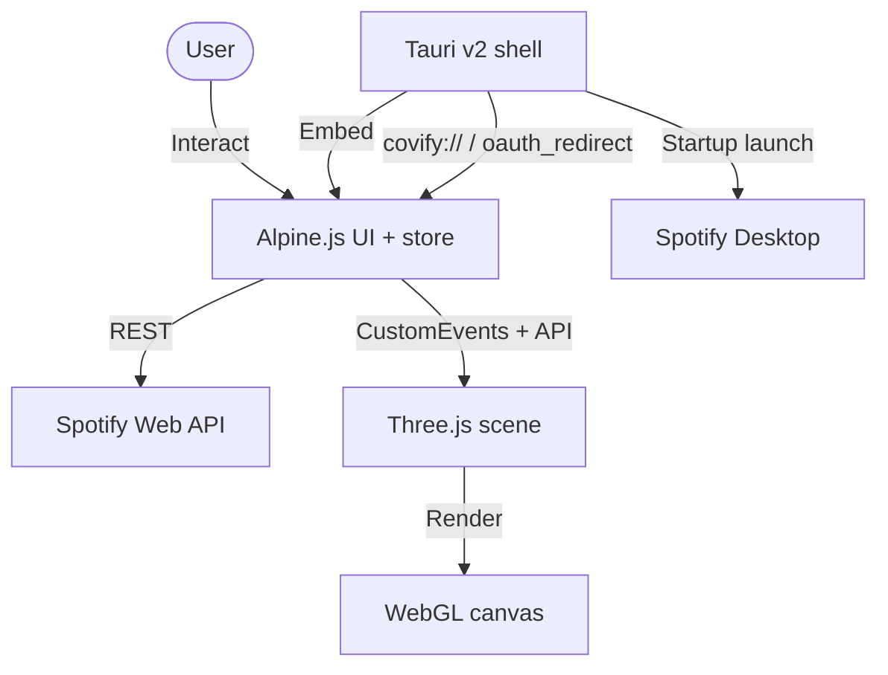

# Covify: System Architecture & Technical Blueprint

**App version:** `1.2.1`

This document specifies the architecture, mathematics, state management, and API design of **Covify**, a 3D Spotify album-art visualizer. It is detailed enough to reproduce the system in another stack (React Three Fiber, Flutter, Unity, Swift, etc.).

For user-facing setup and controls, see [`README.md`](./README.md).

---

## 1. System Overview & Core Concept

Covify connects to a user’s Spotify Premium account and visualizes the **active Spotify playback queue** as interactive album-art planes in WebGL. The home 3D scene is **queue-locked**: it always reflects `/me/player/queue` (plus currently playing when needed), not an arbitrary library playlist selection.

Playing a playlist from the UI starts that context on Spotify, then reloads the queue into the sphere so the visualizer stays in sync with what will play next.

### Core capabilities

| Area | Behavior |
|------|----------|
| **Auth** | OAuth 2.0 Authorization Code + PKCE (browser + Tauri deep link) |
| **Sphere layout** | Fibonacci / golden-angle distribution of covers |
| **Drop layout** | Cascading grid with gravity + damped bounce |
| **List (secondary)** | 2D overlay of the same tracks currently in the scene |
| **Equalizer overlay** | Canvas texture on the active cover while playing |
| **Playback bar** | Seek + hover time; ~20 Hz clock-based progress interpolation |
| **Search / detail** | Global playlist search; owned playlist items; Play to Explore for others |
| **Queue actions** | `POST /me/player/queue` from list rows |
| **Desktop shell** | Tauri 2: launch Spotify, `covify://` OAuth, single-instance |



---

## 2. Directory Structure

```text
Covify/
├── .env / .env.example           # VITE_SPOTIFY_CLIENT_ID
├── .github/workflows/release.yml # Tag-triggered macOS + Windows draft releases
├── README.md
├── SYSTEM_ARCHITECTURE.md        # This file
├── progress.md                   # Historical feature log (may lag code)
├── package.json                  # v1.2.1, Vite/Alpine/Three/Tauri deps
├── vite.config.js                # 127.0.0.1:5173, Tailwind, vendor chunks
├── index.html                    # Auth + main Alpine templates
├── Screenshots/                  # Product screenshots
├── logo-covify.png
│
├── src/
│   ├── main.js                   # Alpine.store('app') — orchestration
│   ├── style.css                 # Design tokens (Spotify-inspired dark)
│   ├── counter.js                # Unused Vite scaffold (dead code)
│   ├── spotify/
│   │   ├── auth.js               # PKCE, tokens, redirect URIs
│   │   └── api.js                # spotifyFetch + domain endpoints
│   └── three/
│       └── sphere.js             # Scene, layouts, raycast, equalizer
│
└── src-tauri/
    ├── Cargo.toml                # app crate v1.2.1
    ├── tauri.conf.json           # Window, deep-link scheme covify
    ├── capabilities/default.json # shell, store, deep-link permissions
    └── src/lib.rs                # Spotify spawn, covify URI protocol, OAuth emit
```

---

## 3. Layered Architecture

1. **Application shell (Tauri / Rust)**  
   Native window, `covify://` protocol, single-instance focus, optional Spotify process launch (macOS/Windows), IPC `oauth_redirect`.

2. **State & logic (Alpine.js / ES modules)**  
   Single global store in `main.js`: auth, playlists, search, playlist detail, queue list overlay, playback polling, optimistic controls, toasts.

3. **Graphics (Three.js)**  
   `sphere.js`: WebGL renderer, OrbitControls, mesh pool, sphere/drop arrangement, hover/play/enlarge raycasting, canvas equalizer.

**No client-side router.** Screens toggle via Alpine `x-show` (`isAuthenticated`, `viewingPlaylist`, `homeListView`, overlays).

---

## 4. State Model (`Alpine.store('app')`)

### Primary fields

| Field | Role |
|-------|------|
| `isAuthenticated`, `user` | Session + profile |
| `playlists`, `currentPlaylist` | Library list + virtual `queue` entry |
| `tracks` | Queue tracks currently driving the **home** sphere |
| `currentTrack`, `isPlaying`, `progress`, `progressMs`, `lastStateSyncTime` | Playback UI + interpolation |
| `sceneMode` | `'sphere'` \| `'drop'` (3D layout) |
| `homeListView` | Secondary list overlay over home scene |
| `searchQuery`, `searchResults`, `searchOffset`, `searchTotal`, … | Playlist search |
| `viewingPlaylist`, `viewingPlaylistTracks`, `playlistViewMode` | Detail overlay (`sphere` \| `list`) |
| `playlistTracksUnavailable` | Non-owned / empty items → Play to Explore UI |
| `enlargedTrack`, `queueToast` | Overlays / feedback |

### Important flows

**Home load**

1. Auth → `initializeScene()` → `loadUser()` → `loadPlaylists()` → `selectPlaylist('queue')` → `getQueueTracks()` → `buildSphereFromTracks(tracks)`.
2. `startPlaybackPolling()` every **4s** (`getCurrentPlayback`).
3. On track id change while polling → reload queue into sphere.

**Play library playlist (sidebar play)**

1. `playTrack(null, playlist.uri)`.
2. After ~1s → `selectPlaylist('queue')` + `syncPlaybackState()` so the sphere shows the new queue.

**Open playlist detail**

1. `openPlaylistDetail(playlist)` → `getPlaylistTracks(id)` via `/playlists/{id}/items`.
2. If tracks exist → `buildSphereFromTracks(tracks, 1.18)` (larger art).
3. If empty / 403 → `playlistTracksUnavailable = true` (Play to Explore).
4. `playEntireViewingPlaylist()` → play context → after delay load queue into detail sphere.

**Open Current Queue detail**

1. `openCurrentQueue()` → fetch queue; prepend `currentTrack` if not in list → sphere with `artScale 1.18`.

**Search**

1. Debounced (~350ms) `searchPlaylists(q, 10, offset)`.
2. Paginate with `searchOffset += 10`.

**Add to queue**

1. `addToQueue(uri)` → `POST /me/player/queue?uri=…` → toast.

**Optimistic controls**

After play/pause/skip/play-from-sphere, set `syncSuspendedUntil = now + 3000` so polling does not overwrite optimistic UI immediately.

---

## 5. Event Bus (window `CustomEvent`)

| Event | Direction | Purpose |
|-------|-----------|---------|
| `covify-track-clicked` | 3D → Alpine | Play icon hit → `playSelectedTrack` |
| `covify-enlarged-open` / `closed` | 3D ↔ Alpine | Enlarged art overlay |
| `covify-close-enlarged` | Alpine → 3D | Close from UI / Escape |
| `covify-mode-changed` | 3D → Alpine | Sync `sceneMode` after `M` or API switch |
| `covify-key-toggle-play` / `prev` / `next` | 3D → Alpine | Keyboard → playback |
| `oauth_redirect` | Tauri → Alpine | Deep-link URL with `?code=` |

Interaction rule in 3D: **click play icon → play**; **click album art → enlarge** (does not play).

---

## 6. Authentication (PKCE)

Implemented in `src/spotify/auth.js`.

### Redirect URIs

| Environment | `REDIRECT_URI` |
|-------------|----------------|
| Browser | `http://127.0.0.1:5173/callback` |
| Tauri | `covify://callback` |

Detection: `IS_TAURI` iff `window.__TAURI_INTERNALS__` exists.

### Scopes (exact)

```text
user-read-playback-state
user-modify-playback-state
user-read-currently-playing
playlist-read-private
playlist-read-collaborative
user-library-read
```

### Flow

1. Generate `code_verifier` (128 chars) and `code_challenge` = Base64URL(SHA-256(verifier)).
2. Authorize at `https://accounts.spotify.com/authorize` with `code_challenge_method=S256`.
3. Browser: full-page redirect. Tauri: open system browser via shell plugin.
4. Callback delivers `code` → `POST https://accounts.spotify.com/api/token` with `code_verifier`.
5. Persist `access_token`, `refresh_token`, `expires_at` (expiry minus 60s buffer) in `localStorage`.
6. On 401 / expired token → refresh grant; failure clears tokens.

---

## 7. Spotify API Client (`api.js`)

### `spotifyFetch`

- Bearer token; JSON body when needed.
- **429**: sleep `Retry-After` seconds, recurse.
- **401**: refresh once, retry (including nested 429).
- **204**: return `null`.

### Domain endpoints

| Function | Method / path | Notes |
|----------|---------------|--------|
| `getCurrentUser` | `GET /me` | |
| `getUserPlaylists` | `GET /me/playlists` | Map `items.total` or legacy `tracks.total` |
| `getPlaylistTracks` | `GET /playlists/{id}/items` | Paginate `next`; map `entry.item \|\| entry.track`; 403 → `[]` |
| `getQueueTracks` | `GET /me/player/queue` | Filter `type === 'track'` |
| `searchPlaylists` | `GET /search?type=playlist` | **limit clamped to ≤ 10** (Feb 2026 Dev Mode) |
| `getCurrentPlayback` | `GET /me/player` | |
| `playTrack` | `PUT /me/player/play` | `context_uri` and/or `uris` + optional `offset` |
| `pausePlayback` / `resumePlayback` | `PUT` pause / play | |
| `skipToNext` / `skipToPrevious` | `POST` | |
| `seekTo` | `PUT /me/player/seek` | |
| `addToQueue` | `POST /me/player/queue?uri=` | Requires active device |

### Dev Mode product constraints (Feb 2026)

- Search `limit` max **10**.
- Playlist **items** only for owned/collaborative playlists; otherwise metadata only → UI **Play to Explore**.
- Prefer `/items` over deprecated `/tracks` for playlist contents.

---

## 8. 3D Graphics Engine (`sphere.js`)

Design colors in code: surface `#121212`, card `#181818`, accent `#1ed760` (Spotify-aligned; ignore stale “Nocturne Stage” comment at file header if present).

### Public API

```js
initScene(canvasId)
buildSphereFromTracks(tracks, artScale = 1)
switchMode('sphere' | 'drop')
getCurrentMode()
updatePlaybackState(trackUri, isPlaying)
destroyScene()
```

### Renderer / camera / controls

- WebGLRenderer: sRGB, ACES Filmic, clear color surface.
- FogExp2 on surface color.
- PerspectiveCamera FOV 50; OrbitControls: damping, no pan, zoom 5–40, auto-rotate on sphere (speed 0.3), off on drop.
- Ambient + directional + accent point light; ~600-point starfield.

### Fibonacci (golden angle) sphere

For \(N\) covers, radius \(R = \max(5, \sqrt[3]{N} \times 1.8)\). For index \(i\):

\[
y_i = 1 - \frac{2i}{N-1},\quad
r_i = \sqrt{1 - y_i^2},\quad
\theta_i = i \cdot \pi(3 - \sqrt{5})
\]

\[
x = r_i\cos\theta_i\,R,\quad
y = y_i\,R,\quad
z = r_i\sin\theta_i\,R
\]

Each frame in sphere mode: `mesh.lookAt(camera.position)` (billboard).

Art plane size from `calculateArtSize(N)` then multiplied by optional `artScale` (e.g. `1.18` in playlist/queue detail).

Textures: batch load (12 at a time), dedupe by URL, prefer ~300px album images, fallback canvas note.

### Cascading drop layout

- Grid columns \(\lceil\sqrt{N}\rceil\), spacing ~2.2.
- Start high \(y \approx 30 + \mathrm{rand}(20)\), fade in.
- Phase \(t \in [0,0.6]\): accelerate down; \(t \in [0.6,1]\): damped bounce  
  \(\sin(t_b \cdot 2.5\pi)\,e^{-4t_b}\cdot 0.3\).
- Settled meshes gently float on sine.

### Equalizer overlay

1. Offscreen canvas 128×128 → `CanvasTexture`.
2. Each frame: dark translucent fill + 4 bars  
   \(h_i = 12 + |\sin(\mathrm{time}+i\cdot 1.6)|\cdot 60 + \mathrm{rand}(8)\) when playing.
3. Mesh follows active cover, `translateZ(0.015)`, scale = art size.

### Raycasting

- Hover: scale ~1.4, weak accent emissive, show play icon + DOM tooltip.
- Click play mesh → `covify-track-clicked`.
- Click art → enlarged view (DOM overlay + disable OrbitControls).

### Keyboard (when focus not in `INPUT`/`TEXTAREA`)

| Key | Dispatched event / action |
|-----|---------------------------|
| Space | `covify-key-toggle-play` |
| ← / → | prev / next |
| Escape | close enlarged |
| M | toggle sphere ↔ drop |

---

## 9. Precision Playback Interpolation

Avoid ticking `progress += dt` alone (drift).

On each successful `/me/player` sync:

- Store `progressMs`, `duration`, `lastStateSyncTime = Date.now()`, `isPlaying`.

Every **50 ms**:

\[
\mathrm{elapsed} = \mathrm{now} - \mathrm{lastStateSyncTime}
\]
\[
\mathrm{currentMs} = \min(\mathrm{duration},\, \mathrm{progressMs} + (\mathrm{isPlaying} ? \mathrm{elapsed} : 0))
\]
\[
\mathrm{progress} = \mathrm{currentMs} / \mathrm{duration}
\]

Seek click:

\[
\mathrm{pct} = \frac{\mathrm{clientX} - \mathrm{rect.left}}{\mathrm{rect.width}},\quad
\mathrm{seekMs} = \mathrm{pct} \times \mathrm{duration}
\]

→ `PUT /me/player/seek?position_ms=…` and reset local anchors.

---

## 10. Desktop Shell (Tauri v2)

| Concern | Implementation |
|---------|----------------|
| Window | Title Covify, 1100×720, min 800×600 (`tauri.conf.json`) |
| Deep link | Scheme `covify`; protocol handler emits `oauth_redirect` with full URL |
| Plugins | deep-link, shell, store, single-instance (+ log in debug) |
| Capabilities | `shell:allow-open`, `store:default`, `deep-link:default` |
| Spotify launch | macOS `open -g -a Spotify`; Windows `cmd /C start spotify:`; then refocus main window ~800 ms later |
| Identifier | `com.sammit.covify` |

Frontend also listens via `@tauri-apps/plugin-deep-link` `onOpenUrl` as a second path for the same callback.

---

## 11. Build & Packaging

### Vite (`vite.config.js`)

- Host `127.0.0.1`, port `5173`, `strictPort`.
- Tailwind via `@tailwindcss/vite`.
- Production: split vendor chunks (`three`, `alpine`, `tauri`); `chunkSizeWarningLimit: 700`.

### Scripts

| Script | Role |
|--------|------|
| `npm run dev` | Vite (Tauri beforeDevCommand) |
| `npm run dev:local` | Vite + open browser |
| `npm run build` | `dist/` for Tauri / static |
| `npm run tauri dev` / `build` | Desktop |

### CI (`.github/workflows/release.yml`)

On push of tags `v*`: build universal macOS + Windows via `tauri-apps/tauri-action`, create **draft** release.

Keep versions aligned: `package.json`, `tauri.conf.json`, `Cargo.toml` / `Cargo.lock` app package.

---

## 12. Design System (UI)

Defined in `src/style.css` `@theme`:

| Token | Hex | Use |
|-------|-----|-----|
| surface / panel | `#121212` | App background |
| card | `#181818` | Bars, dialogs |
| button | `#1f1f1f` | Secondary controls |
| accent | `#1ed760` | Primary actions |
| accent-dim | `#1db954` | Hover |
| text | `#ffffff` | Primary type |
| muted | `#b3b3b3` | Secondary type |
| border | `#4d4d4d` | Hairlines |

Pill radius `500px`; elevated/dialog shadows for CTAs and chrome.

---

## 13. Porting Checklist

To reimplement Covify elsewhere:

1. **PKCE auth** with platform-specific redirect (`127.0.0.1` vs custom scheme).
2. **Queue-locked visualizer** — never assume selected playlist tracks fill the home scene unless you intentionally change the product model.
3. **Poll** `/me/player` ~4s; suspend ~3s after local controls; interpolate progress with wall clock.
4. **Fibonacci sphere** math + per-frame billboards; optional drop physics.
5. **Equalizer** as dynamic canvas / render-target texture on the active mesh.
6. **Raycast** split: play affordance vs inspect.
7. **Search** with limit ≤ 10; playlist **items** only when owned; else play-then-queue.
8. **Rate limits**: honor `Retry-After` on 429.
9. Match Spotify Developer Terms (no long-term content caching beyond immediate UI use; attribution).

---

## 14. Document history

This blueprint was updated for **v1.2.1** to reflect queue-driven home visualization, playlist search/detail, list overlays, add-to-queue, `/playlists/{id}/items`, Dev Mode search limits, full OAuth scopes, CustomEvent bus, `artScale`, and Tauri/CI packaging. Prefer the source under `src/` if this file and `progress.md` disagree.
